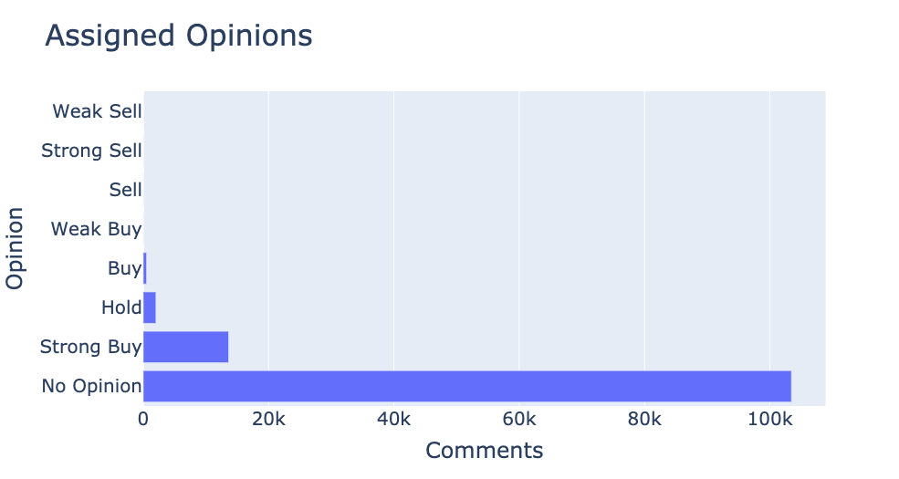

# Retail Investor Sentiment Analysis
## Overview
Early in 2021, a slowly fading US high-street retailer by the name of GameStop underwent a remarkable, yet short-lived, recovery phase, seeing its publicly listed share price skyrocket by 1,900% over a 2-week period. The move was prompted not by business fundamentals, but rather a large online community of retail investors on the popular sub-reddit WallStreetBets. Online comments encouraged users to club together to buy the stock, in an effort to ‘short-squeeze’ a single larger entity who had shorted the stock. Once the stock passed a certain threshold, the large short position was closed out causing further dramatic price rises.

The event was significant enough for US financial regulators to examine the ‘integrity of markets’, with some suggestions of market manipulation being at play. Perhaps more interestingly from the perspective of a retail investor, was the demonstration of influence that online communities can have in financial markets.

This project aims to use Natural Language Processing techniques to measure investor sentiment, based on posts that users make on an online financial share chat website, and to investigate if the sentiment measure has any correlation with the price of the stock. This website hosts dedicated share chat threads for individual stocks, some of which have a good level of activity for smaller AIM (LSE:AIM) listed companies. The AIM stock market consists of smaller companies due to its more flexible regulatory system. The hope in targeting an active message board, for a smaller to medium market cap company, is to cover as large as possible proportion of the retail investors for the stock in question.

## Repository Contents
TBC

## Goals
As discussed above, this project aims to:
1. Explore NLP techniques to generate investor sentiment metrics
2. Evaluate sentiment metrics against price movements over time
3. Investigate whether investor sentiment could be used as a leading indicator of price

### Success Criteria
To build a model that predicts a sentiment classification better than a baseline measure.

## Data Source
Data will be scraped from the share chat page of a stock, Greatland Gold (LSE:AIM), from a popular share information website. The choice of this particular stock was solely because of its seemingly active user base.

Using the Beautiful Soup library, 120,000 comments were successfully scraped from the website, which equated to almost 600 days worth of comments.
Embedded with each post along with the comment itself, was the price of the stock at the time of the post and a selected ‘opinion’ of the stocks prospects. This opinion field was a categorical selection that the posted could select at the time of the post.

## Data Cleaning
Due to the data being scraped from HTML, some basic cleaning was required:
- Removal of the date which had been added to the title field
- Reformatting of the first (most recent) 5 days of dates from the time and day of week (ie 14:20, Tuesday) to the date (26 Nov 2021)
- Converting the date field to a pandas datetime object
- Removing the ‘Price:’ string from the price and converting to float

## Exploratory Data Analysis
The scrape yielded a table of 120,000 comments and the following 6 columns:
- User
- Title
- Comment
- Price
- Opinion
- Date

One of the early observations was the opinion categorical selection that users make during a post. The vast majority of posts were assigned as ‘no opinion’ by default. This offered a good NLP problem in assigning the unassigned comments based on what words were being used in the assigned ones.

### Time Series Data Subset
As the aims of the project were to assess correlations to price, it was important that the date was aggregated by date. Doing this yielded a second dataset with the following features:
- Date (index): by day
- Open Price: the price embedded into the first comment of the day
- High: the highest price seen in a comment in a day
- Low: the lowest price seen in a comment in a day
- Range: the magnitude between the high and the low
- Number of Comments: the number of comments made in that day

This time series dataset allowed for more EDA, most notably being able to plot the share price chart. In addition to this, some interesting correlations were observed in areas that were not necessarily the ones being looked at. The chart below shows a strong correlation between the daily price range plotted against the number of comments made per day. 

## Feature Engineering
As mentioned previously, the ‘opinion’ field offered a good NLP modeling problem - seeing if the word usage on negative comments and positive comments could be used to predict whether a comment was assigned positive or negative. Going back to the original dataset, the majority of comments are assigned ‘No Opinion’. Removing all of these comments gives us 16,500 assigned comments having the distribution shown below.

As can be seen above, the subset of assigned opinion comments is highly unbalanced, with the vast majority assigned to strong buy. As this dataset represented holders of the stock, perhaps this shouldn't have come as too much of a surprise.

In order to frame the modeling part of the project it was necessary to aggregate the assigned opinions into a binary target variable. Taking the strong bias present in the dataset into account, it was decided to assign just strong buy and buy to be a positive comment, with hold being assigned to be negative despite its literal meaning being more neutral. This also should give the models a larger sample size to work with, as there were only 19 comments assigned as sell.

## Modeling
For the modeling, further processing was applied to the comments to remove stop words, tokenize words and remove any special characters. Each comment field would then be fed into a Count Vectorized table and a Term Frequency - Inverse Document Frequency (Tf-idf) table, each table consisting of a sparse matrix of 38,000 columns/words.

### Results
A logistic regression and a random forest model was applied to both the above tables, yielding the results shown below.

As can be seen, all the models performed quite similarly, each beating the baseline accuracy by 1%. While this was an improvement over a random guess, it was relatively underwhelming in terms of a predictive model.

Going back to the full dataset of 120,000 comments, including the ‘No Opinion’ comments, the best performing model can now be used to predict the positive or negative opinion of each comment. This dataset can now be treated as unseen data, meaning it cannot be evaluated with a numerical score, but what happens if the average predicted opinion is averaged over a day, brought into the previous time series dataset and plotted against the stock price over time? In the chart below, a positive prediction is assigned as 1 and negative 0, allowing the mean prediction per day to be calculated.

Again, the eye test gives a relatively underwhelming outcome, with not a lot of clear correlation between the average predicted opinion and price.

## Sentiment Analysis
Another area to explore was using sentiment classification techniques, to score every comment based on the words used in that comment aside from the assigned opinion field. For this part, two different sentiment classification tools were explored, both of which were required to run in the textacy environment:
1. Using a word sentiment dataset: this tool used a look-up .csv table with 155k words, each with a positive and negative score along with word type (noun,verb, adjective etc)
2. Using the VADER sentiment classification package: a self contained library developed by MIT and “specifically attuned to sentiments expressed in social media”. This classifier would yield a positive, negative, neutral and compound score for every comment.

Taking the previously processed comments and running the sentiment classifiers above, we are able to follow the same steps as before, aggregate the average positive and negative scores per day and append them to the time series dataset. The charts below show the slightly better performing VADER sentiment scores.

## Future Work
Now that the most effective sentiment classification has been established, the natural next step would be to scrape more data and use some time series methods, to evaluate if any previous changes in sentiment could be used in a predictive manner with regards to the price.
Expanding the dataset to look at other stocks could also be a natural next step.
Additionally, RNS news releases could be incorporated into the charts to see if they have had any effect on investor sentiment.

## Limitations
With regard to the modeling part, based on assigned opinions, the main limitation was related to the highly imbalanced nature of the dataset; predicting the sentiment of a group made mostly of users who hold a stock inherently is going to present a strong positive bias.

Other limitations throughout the project related to the time taken in both learning some new NLP techniques that were not covered in the course content, and the time taken to run the classification models on NLP datasets, due to the large size of them (16,000 rows, 38,000 columns).

## Key Learnings
It can be seen that the above sentiment classifications appear to better correlate with the share price. On reflection, it could be less of a surprise that these classifiers appear to have worked much better than the previous models did. When the share price is performing badly, the users, who are mostly all holders, are going to be posting comments with more negative language than when it is performing well. It can be a much more arbitrary decision when a user decides to select an opinion to put in their post, and perhaps this is why the models did not perform so well.
